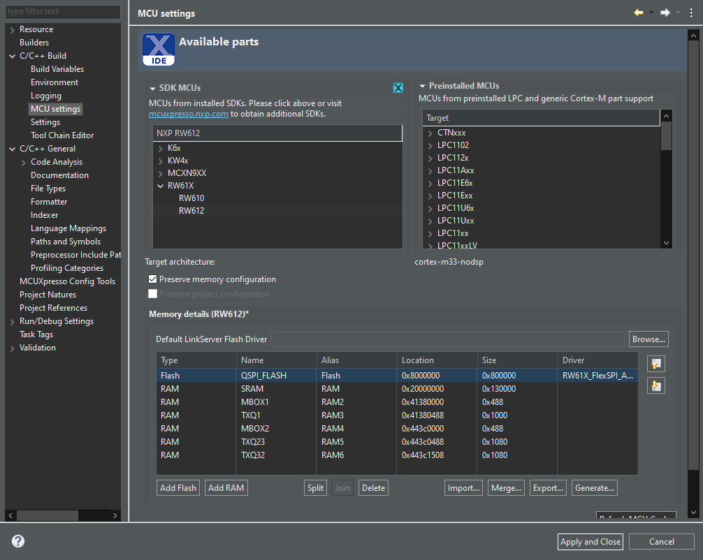
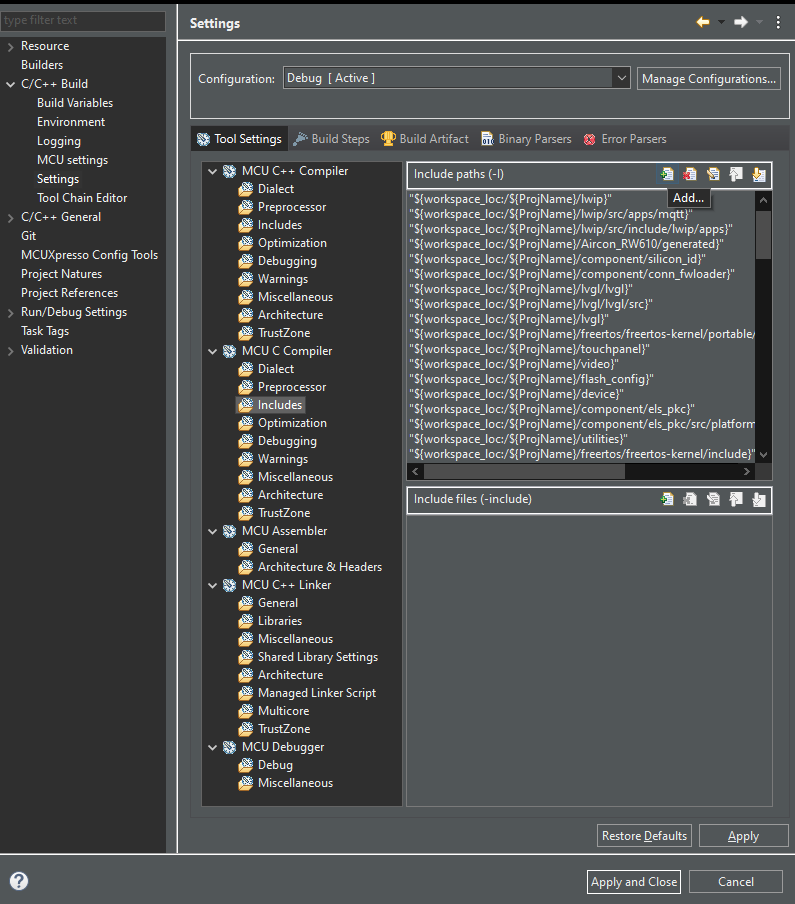
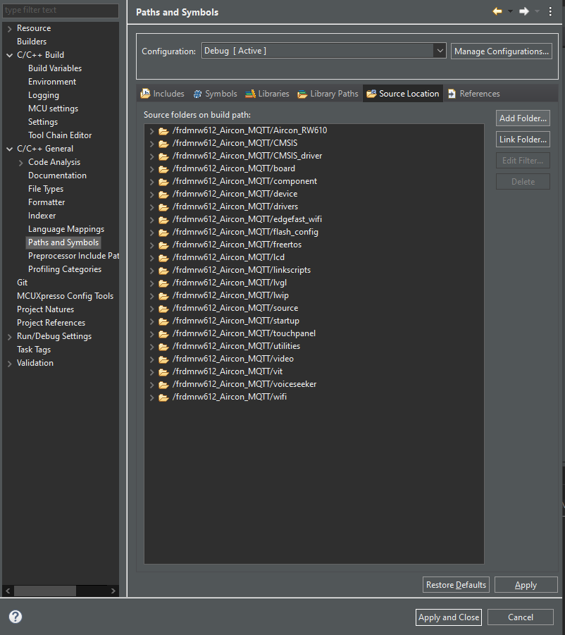
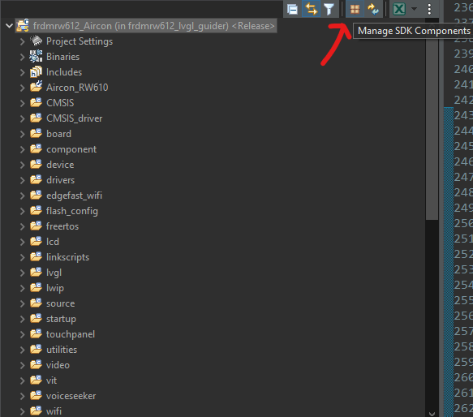
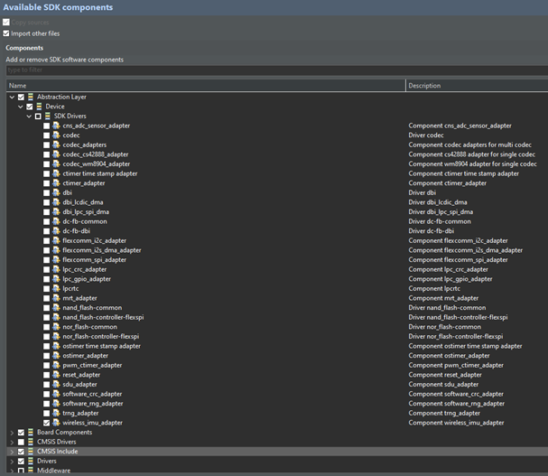
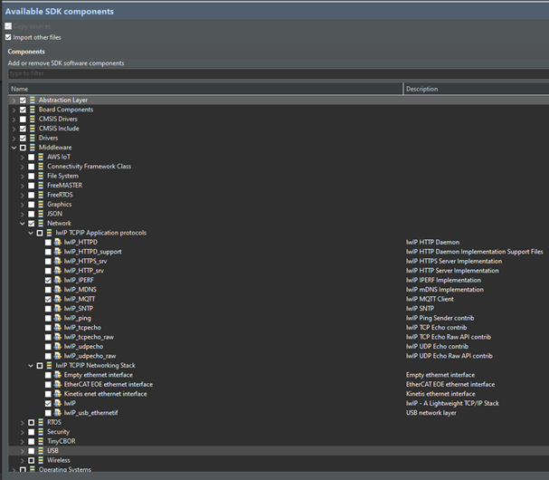
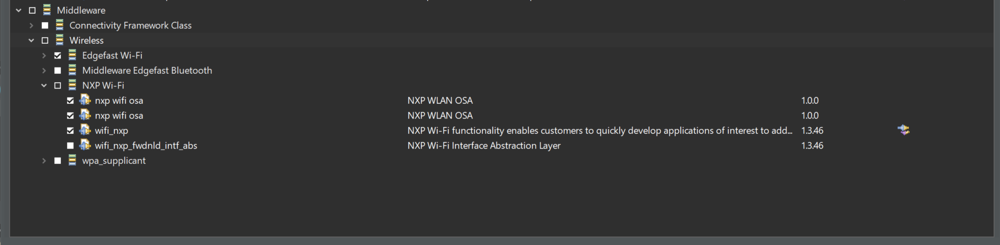

# Guide to add Wi-Fi and MQTT to projects based on the RW612-FRDM.

The objective of this application note is to help developers to integrate Wi-Fi/MQTT to their applications on the RW612-FRDM board. This application note contains: <br />• A quick guide on what to do to add the Wi-Fi drivers and MQTT functions to your exsiting project.

### Adding Wi-Fi to your project

Fisrt make sure to add the needed configurations for the reserved memory sections for the IMU buffers.



Now Add the wifi/lwip drivers to your project, this can be done either by using the [manage SDK components](#SDK_MNG) on the project menu, or by simple copying the folders with those drivers from other wifi MQTT demo project or sdk example to the project where you want to add MQTT functionalities. 

If you want to copy the drivers from another existing WiFi project or demo the copy and paste the following:

wifi: 


lwip:


Keep in mind that if you simply copy the folders with the drivers you might run into build issues because the folders are not included in the project settings automatically, to include them open: 

    project settings -> C/C++ Build -> Settings -> Tool Settings -> MCU C Compiler -> Includes 


and include the added folders, do the same on: 

    project settings -> C/C++ General -> Paths and Symbols -> Source Location


Also be aware that the wifi or lwip folders may contain demo project files that might not be ignored by the building process and mark errors such as “multiple definitions of main()”, to avoid any errors simply delete these demos.

### To add the SDK components manually <a name="SDK_MNG"></a>:





make sure you at least have the basic drivers:
- imu
- wireless_imu_adapter
- lwIP_IPREF
- lwIP_MQTT
- lwIP
- nxp_wifi
- Edgefast_Wi-Fi

### Setup in code
Once the project is correctly setup with the needed drivers you will need to add the necessary configurations for your code to use Wi-Fi and connect to the desired MQTT broker.

First make sure to define important strings such as the SSID and Password of your network or the IP address of your MQTT host. You can do this in a general app configuration header file and simply include it where required.
To initialize the Wi-Fi module and connect to your network and broker you will need to use the following code:
```c
    uint32_t result = 0;

    /* Initialize Wi-Fi board */
    PRINTF("[i][Wi-Fi] Initializing Wi-Fi connection... \r\n");

    result = WPL_Init();
    if (result != WPLRET_SUCCESS)
    {
        PRINTF("[!][Wi-Fi] WPL Init failed: %d\r\n", (uint32_t)result);
        __BKPT(0);
    }

    result = WPL_Start(LinkStatusChangeCallback);
    if (result != WPLRET_SUCCESS)
    {
        PRINTF("[!][Wi-Fi] WPL Start failed %d\r\n", (uint32_t)result);
        __BKPT(0);
    }

    PRINTF("[i][Wi-Fi] Successfully initialized Wi-Fi module\r\n");

    ConnectTo();

    wifi_connected = true;

    active_ser_status(connected_wifi);
    /* Call the WiFi connected callback */
    if(conn_callback) conn_callback();
```
ConnectTo Function: 
```c
static void ConnectTo()
{
        int32_t result;

        /* Add Wi-Fi network */
        result = WPL_AddNetwork(AP_SSID, AP_PASSWORD, WIFI_NETWORK_LABEL);
        if (result == WPLRET_SUCCESS)
        {
            do {
                PRINTF("[i][Wi-Fi] Connecting as client to ssid: %s with password %s\r\n", AP_SSID, AP_PASSWORD);
                result = WPL_Join(WIFI_NETWORK_LABEL);
                if (result != WPLRET_SUCCESS)
                {
                    PRINTF("[!][Wi-Fi] Failed to connect to Wi-Fi - ssid: %s passphrase: %s\r\n", AP_SSID, AP_PASSWORD);
                    vTaskDelay(5000);
                }
                else
                {
                    PRINTF("[i][Wi-Fi] Connected to Wi-Fi - ssid: %s passphrase: %s\r\n", AP_SSID, AP_PASSWORD);
                    char ip[16];
                    WPL_GetIP(ip, 1);

                }
            }while(result != WPLRET_SUCCESS);
        }
        else {
            PRINTF("[!][Wi-Fi] Failed to add network to WPL - ssid: %s passphrase: %s\r\n", AP_SSID, AP_PASSWORD);
        }
}
```
You can  either put the code in a FreeRTOS task, or simply run it in your main() when the program begins as part of the initializations. 


The implementation of these functions and more on how to use them can be seen in the [wifi_task.c](frdmrw612_Aircon_MQTT/source/wifi_task.c) file.

Once connected you can call the functions in mqtt_freertos such as:
```c
    mqtt_freertos_publish();
```
to publish to your MQTT Broker.