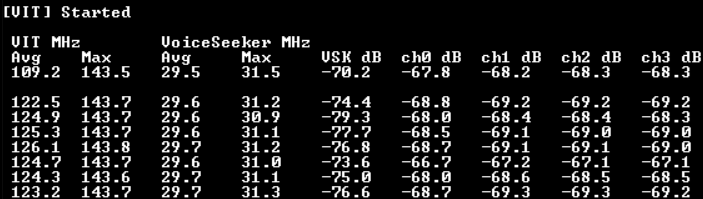

# NXP Application Code Hub
[](https://www.nxp.com)

## Smart AirCon with Wi-Fi and MQTT demo based on the FRDM-RW612 board

This demo is based on the [Smart Aircon Demo](https://github.com/nxp-appcodehub/dm-rw612frdm-smart-aircon-demo.git) but adding Wi-Fi/MQTT. If you wish to learn how to add Wi-Fi/MQTT to your projects on the FRDM-RW612 check the [Guide to add WiFi_MQTT](Guide%20to%20add%20WiFi_MQTT.md) document.


This demo runs on two different boards: Publisher and Subscriber
* **Publisher board**: It runs the S2I engine and publishes any identified command to the MQTT server (broker). It also updates its display with the S2I identified commands. But it will also subscribe and update the screen when another publisher updates any aircon values through MQTT.
* **Subscriber board**: It subscribes to the MQTT topics published by the Publisher board and updates its display with the received commands.

#### Boards: FRDM-RW612
#### Categories: Graphics, RTOS, Voice, Wi-FI, MQTT
#### Peripherals: Display, DMIC Board
#### Toolchains: MCUXpresso IDE

## Table of Contents
1. [Software](#step1)
2. [Hardware](#step2)
3. [Setup](#step3)
4. [Results](#step4)
5. [FAQs](#step5)
6. [Support](#step6)
7. [Release Notes](#step7)

## 1. Software<a name="step1"></a>
- [MCUXpresso IDE v25.06.0](https://www.nxp.com/design/design-center/software/development-software/mcuxpresso-software-and-tools-/mcuxpresso-integrated-development-environment-ide:MCUXpresso-IDE)
- [FRDM-RW612 SDK (SDK\_25\_06\_0\_FRDM-RW612)](https://mcuxpresso.nxp.com/builder?hw=FRDM-RW612&rel=890)
- [FRDM-RW612 Smart AirCon with MQTT Demo project](https://github.com/nxp-appcodehub/dm-rw612frdm-smart-aircon-with-wifi-and-mqtt/tree/main/frdmrw612_Aircon_MQTT)

## 2. Hardware<a name="step2"></a>
### 3.5” 480x320 IPS TFT LCD Module (two)
#### LCD-PAR-S035

[<p align="center">](https://www.nxp.com/design/design-center/development-boards-and-designs/general-purpose-mcus/3-5-480x320-ips-tft-lcd-module:LCD-PAR-S035)

##### LCD-PAR-S035 configuration:
Make sure the LCD is set to SPI 4-wire mode with the dip switches on the back of the board.

### Configurable Digital Microphone Board (one)
#### 8CH-DMIC

[<p align="center">](https://www.nxp.com/design/design-center/development-boards-and-designs/i-mx-evaluation-and-development-boards/configurable-digital-microphone-board:8CH-DMIC)

##### 8CH-DMIC configuration:
<li>Connect 1-2 jumpers J3/J4/J8/J12
<li>Connect 1-2 jumpers J5/J14/J15
<li>Disconnect the rest of the jumpers</li>


### FRDM RW612 Board
<p align="center">

### (Optional) Raspberry PI 3B+ for Wi-Fi Access point and MQTT Broker
#### Rapsberry PI 3B+

[<p align="center">](https://www.raspberrypi.com/products/raspberry-pi-3-model-b-plus/)

You can setup an Access point and MQTT Broker with a rapsberry with the following guide:
##### [Wi-Fi Access point and MQTT server setup guide](RaspberryPISetup.md)

## 3. Setup<a name="step3"></a>
#### LCD:
<li>Connect the LCD PMOD header into the FRDM-RW612 PMOD Header.

#### DMICs:
<li>Connect pin 3 of DMIC board into pin 7 of header J4 of the FRDM-RW612.
<li>Connect pin 4 of DMIC board into pin 9 of header J4 of the FRDM-RW612.
<li>Connect pin 11 of DMIC board into pin 14 of header J3 of the FRDM-RW612 (GND).
<li>Connect pin 1 of DMIC board into pin 8 of header J3 of the FRDM-RW612 (3.3V).</li>

### Wi-Fi Access point and MQTT broker

The demo's Wi-Fi credentials, MQTT broker, user and password can be set in run time on the touch screen using the gear icon on the top center of the screen. This will trigger a network scan on tap, allowing you to select from nearby available networks.

For the MQTT part you can also use an application on your phone to act as a control panel. For example IoT MQTT Panel:
[<p align="center">](https://play-lh.googleusercontent.com/YCy6ru4oQUdSwWOjUc6bip8RWt3arP9cIg5JSNAC43huJPq3qIA6FGdv9wrmtf6WwqU)


### How to run:

1. Build and download the demo into the FRDM board with the desired configuration.

You can enable/disable VIT publishing for voice control. 

Voice Control and publishing on:

```c
#define AIRCON_PUBLISHER_VIT 1
```

Voice Control and publishing off:

```c
#define AIRCON_PUBLISHER_VIT 0
```

This will disable the DMICS, so you will not be able to use voice commands or publish to the MQTT topic from the FRDM-RW612 Board, it will only act as a subscriber.

2. Open a serial terminal. (optional)
3. Interact with the GUI via voice commands or the MQTT app.

### Intent examples
```
Hey NXP, POWER ON
Hey NXP, POWER OFF
Hey NXP, LOW SPEED
Hey NXP, MEDIUM SPEED
Hey NXP, HIGH SPEED
Hey NXP, COOL MODE
Hey NXP, DRY MODE
Hey NXP, SWING ON
Hey NXP, SWING OFF
Hey NXP, HEAT UP
Hey NXP, COOL DOWN
Hey NXP, HALF HOUR TIMER
Hey NXP, QUARTER HOUR TIMER
```


## 4. Results<a name="step4"></a>
Smart Aircon Demo with MQTT running on a FRDM board and controlled with IoT MQTT Panel app:
<p align="center">

Once the demo app has been successfully flashed into the board and the app is running the RGB LED in the FRDM-RW612 board will quickly flash 5 times in the publisher board to indicate that the initialization process was successful and that the app is ready to receive commands. When both the Wi-Fi symbol and the server symbol turn blue on the display the app has successfully connected to Wi-Fi and the MQTT broker. When the wake up word is detected, the blue LED will be turned on, until a command is detected successfully or not detected and thus timed out, after the blue LED turns off you can attempt a command again.

### Troubleshooting

- On the serial terminal make sure each mic channel has an acceptable level. See the following image as an example of the mic levels on an office setting (2 channels enabled, ch0 and ch1).

- On the serial terminal make sure Wi-Fi and MQTT are being properly initialized and connect to the desired network.


## 5. FAQs<a name="step5"></a>
No FAQs have been identified for this project.

## 6. Support<a name="step6"></a>


#### Project Metadata

<!----- Boards ----->
[](https://www.nxp.com/pip/RW612)

<!----- Categories ----->
[](https://github.com/search?q=org%3Anxp-appcodehub+memory+in%3Areadme&type=Repositories)

<!----- Peripherals ----->
[](https://github.com/search?q=org%3Anxp-appcodehub+flash+in%3Areadme&type=Repositories)

<!----- Toolchains ----->
[](https://github.com/search?q=org%3Anxp-appcodehub+mcux+in%3Areadme&type=Repositories)

Questions regarding the content/correctness of this example can be entered as Issues within this GitHub repository.

>**Warning**: For more general technical questions regarding NXP Microcontrollers and the difference in expected functionality, enter your questions on the [NXP Community Forum](https://community.nxp.com/)

[](https://www.youtube.com/NXP_Semiconductors)
[](https://www.linkedin.com/company/nxp-semiconductors)
[](https://www.facebook.com/nxpsemi/)
[](https://x.com/NXP)

## 7. Release Notes<a name="step7"></a>
| Version | Description / Update                           | Date                        |
|:-------:|------------------------------------------------|----------------------------:|
| 1.0     | Initial release on Application Code Hub        | April 10<sup>th</sup> 2026 |

<small>
<b>Trademarks and Service Marks</b>: There are a number of proprietary logos, service marks, trademarks, slogans and product designations ("Marks") found on this Site. By making the Marks available on this Site, NXP is not granting you a license to use them in any fashion. Access to this Site does not confer upon you any license to the Marks under any of NXP or any third party's intellectual property rights. While NXP encourages others to link to our URL, no NXP trademark or service mark may be used as a hyperlink without NXP’s prior written permission. The following Marks are the property of NXP. This list is not comprehensive; the absence of a Mark from the list does not constitute a waiver of intellectual property rights established by NXP in a Mark.
</small>
<br>
<small>
NXP, the NXP logo, NXP SECURE CONNECTIONS FOR A SMARTER WORLD, Airfast, Altivec, ByLink, CodeWarrior, ColdFire, ColdFire+, CoolFlux, CoolFlux DSP, DESFire, EdgeLock, EdgeScale, EdgeVerse, elQ, Embrace, Freescale, GreenChip, HITAG, ICODE and I-CODE, Immersiv3D, I2C-bus logo , JCOP, Kinetis, Layerscape, MagniV, Mantis, MCCI, MIFARE, MIFARE Classic, MIFARE FleX, MIFARE4Mobile, MIFARE Plus, MIFARE Ultralight, MiGLO, MOBILEGT, NTAG, PEG, Plus X, POR, PowerQUICC, Processor Expert, QorIQ, QorIQ Qonverge, RoadLink wordmark and logo, SafeAssure, SafeAssure logo , SmartLX, SmartMX, StarCore, Symphony, Tower, TriMedia, Trimension, UCODE, VortiQa, Vybrid are trademarks of NXP B.V. All other product or service names are the property of their respective owners. © 2021 NXP B.V.
</small>
